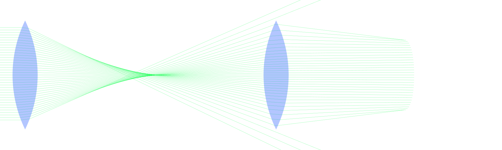

# Optical Ray Tracing

Small program to perform ray tracing on spherical lenses (only convex ones supported now).
The algorithm is fully implemented in Python, which could become faster if numpy arrays
are replaced with simpler memory structures. The results can be plotted in a canvas using
Cairo, which accepts svg and pdf outputs.
